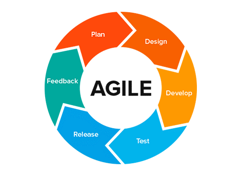

  

### Hi Friends, I'm Sarfaraz 👋
----- 

#### A Software Engineer that works as **React Developer** at **[Tech Mahindra](https://techmahindra.com/)**
- ❤️ Would like to work with people who can make a difference in the world.
- 😎 Open to full time opportunities if the project sounds cool.
- 🏢 Previously a Senior Software Engineer at **Publicis Sapient**
- ⚙️ Love working with:  `.jsx`,`.js`, `.ts`, `.html`, `.scss`, `.json`
- 🌍 I support and volunteer with: **Art of living**
- 🌱 Learning more about and studying: **Open Source, React, Javascript**
- 💬 Ping me about: **mentorship**, **coding**
- 📫 Reach me asap: <a href="https://www.linkedin.com/in/hsarfaraz/">LinkedIn</a> or message.sarfarazhussain@yahoo.com
- 💜 Interests: Flute, Cricket.
- 😄 Passionate about coding and committed to a web that works for everyone

### Side Projects

- [Ecommerce]() - Created Ecomerce Project
- [CRUD app]() - Created CRUD app

### ⚒&nbsp;&nbsp;&nbsp;My Development Toolbelt
&nbsp;&nbsp;&nbsp;&nbsp;&nbsp;&nbsp;&nbsp;&nbsp;&nbsp;&nbsp;&nbsp;&nbsp;&nbsp;&nbsp;&nbsp;&nbsp;&nbsp;  

#### Other Skills
&nbsp;
&nbsp;&nbsp;&nbsp;&nbsp;
&nbsp;&nbsp;&nbsp;&nbsp;

#### Find me around the web 🌎:
- 💼 Connecting and sharing professional updates on <a href="https://www.linkedin.com/in/hsarfaraz/">LinkedIn</a>
- 🌐 Updating my work on <a href="https://github.com/HSarfaraz">Github.com</a>

### Contact

Feel free to connect with me on [LinkedIn](https://www.linkedin.com/in/hsarfaraz/), to explore the transformative potential of Open Source and build a better future on the web together!

